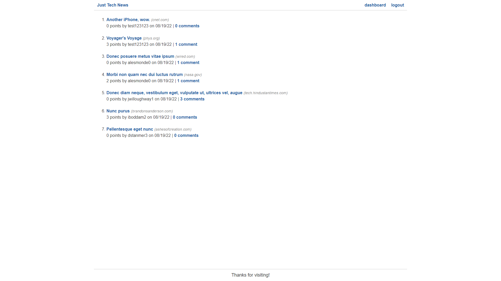
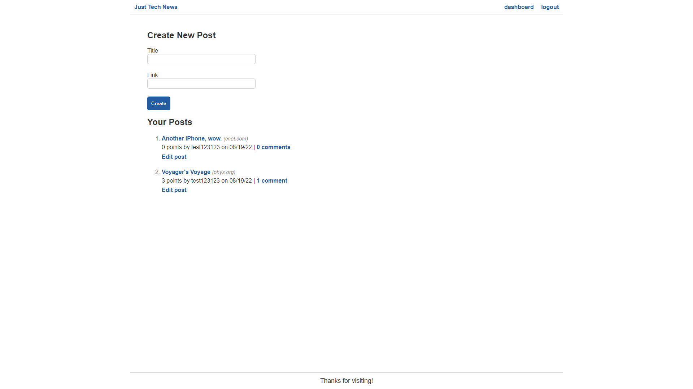
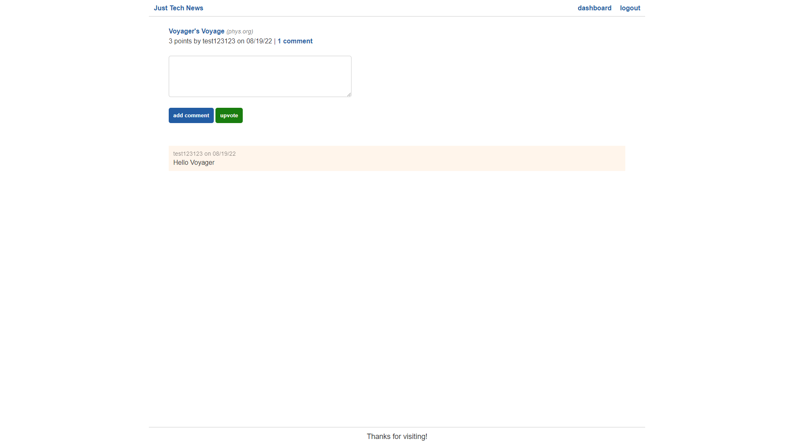

# Python Newsfeed

 

## Description

- An application that allows users to submit links to tech-related articles, comment on other users' articles, and upvote articles for points. A refactor of provided code to learn Python.

## Table of Contents

1. [Installation](#installation)
2. [Usage](#usage)
3. [Demonstration](#demonstration)
4. [License](#license)
5. [How to Contribute](#how-to-contribute)
6. [Questions?](#questions)

## Installation

**This application is deployed to Heroku, and you can access it [here](https://shrouded-tor-99759.herokuapp.com/).**

Alternatively, you can clone this repo. 

If performing a manual installation, you need to install [Python](https://www.python.org/downloads/).

To install dependencies, open in [Visual Studio Code](https://code.visualstudio.com/) or your perferred editor, and set up the virtual environment by running:

    python -m venv venv

Next, activate the virtual environment by running:

    venv/scripts/activate

Finally, install dependencies by running:

    pip install -r requirements.txt

## Usage

**This application is deployed to Heroku, and you can access it [here](https://shrouded-tor-99759.herokuapp.com/).**

Alternatively, once the dependencies are installed, and the virtual environment is activated, run: 

    python -m flask run

The application runs locally on port 5000.

Once the server has been started, in your browser, navigate to http://127.0.0.1:5000/

##  Demonstration

**This application is deployed to Heroku, and you can access it [here](https://shrouded-tor-99759.herokuapp.com/).**

some screenshots:

## License

This application is covered under the [MIT](https://opensource.org/licenses/MIT) license

----------------------------------------------------------------

  Copyright © 2022 Richard Zhang

  Permission is hereby granted, free of charge, to any person obtaining a copy of this software and associated documentation files (the "Software"), to deal in the Software without restriction, including without limitation the rights to use, copy, modify, merge, publish, distribute, sublicense, and/or sell copies of the Software, and to permit persons to whom the Software is furnished to do so, subject to the following conditions:
  
  The above copyright notice and this permission notice shall be included in all copies or substantial portions of the Software.
  
  THE SOFTWARE IS PROVIDED "AS IS", WITHOUT WARRANTY OF ANY KIND, EXPRESS OR IMPLIED, INCLUDING BUT NOT LIMITED TO THE WARRANTIES OF MERCHANTABILITY, FITNESS FOR A PARTICULAR PURPOSE AND NONINFRINGEMENT. IN NO EVENT SHALL THE AUTHORS OR COPYRIGHT HOLDERS BE LIABLE FOR ANY CLAIM, DAMAGES OR OTHER LIABILITY, WHETHER IN AN ACTION OF CONTRACT, TORT OR OTHERWISE, ARISING FROM, OUT OF OR IN CONNECTION WITH THE SOFTWARE OR THE USE OR OTHER DEALINGS IN THE SOFTWARE.

  ----------------------------------------------------------------

## How to Contribute

If you want to contribute to this project and make it better, your help is very welcome. This was a school project, so anything you want to do to it, go for it. You can also contact me directly through the links below.

## Questions?

Have any questions? Here is a list of my links:
- GitHub: [RichardZhang01](https://github.com/RichardZhang01)
- Email: richardzhiyuanzhang@gmail.com

